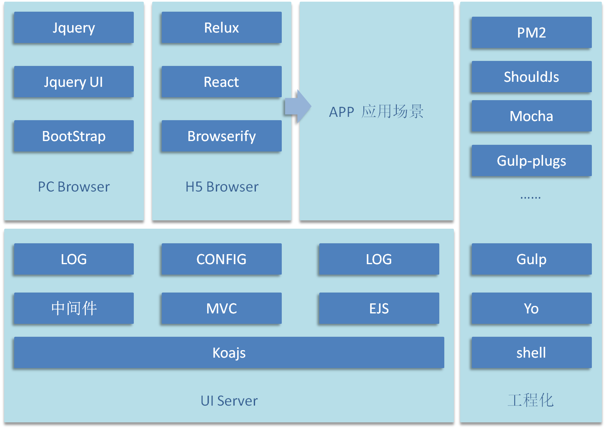
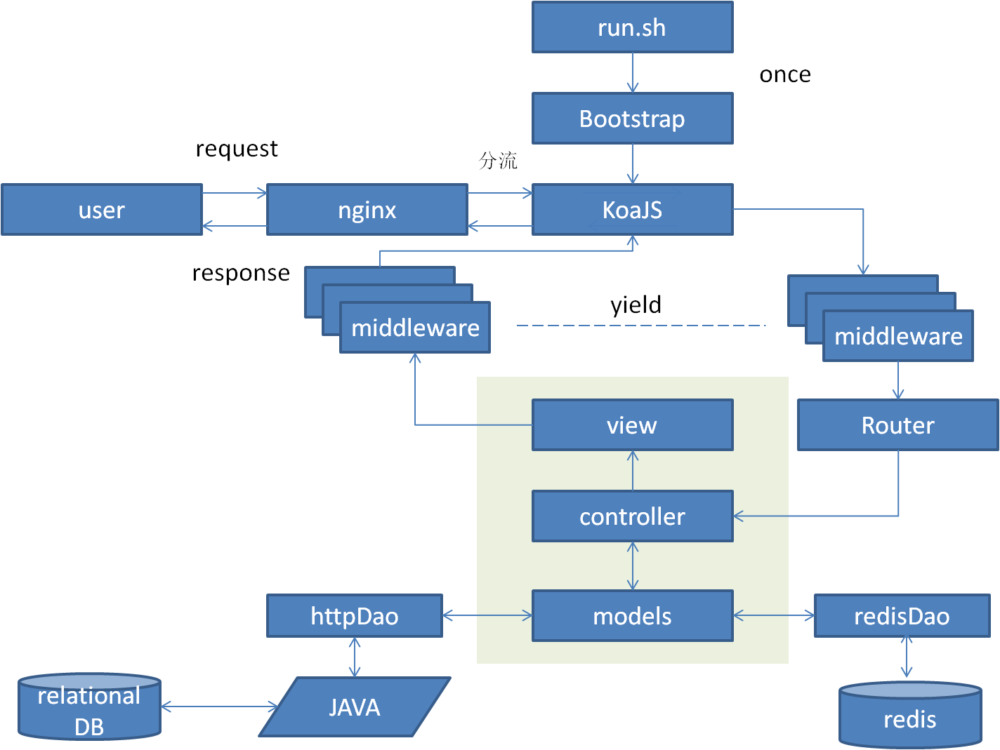
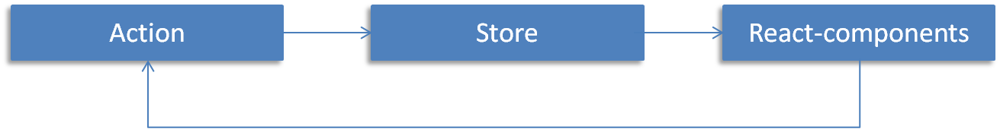
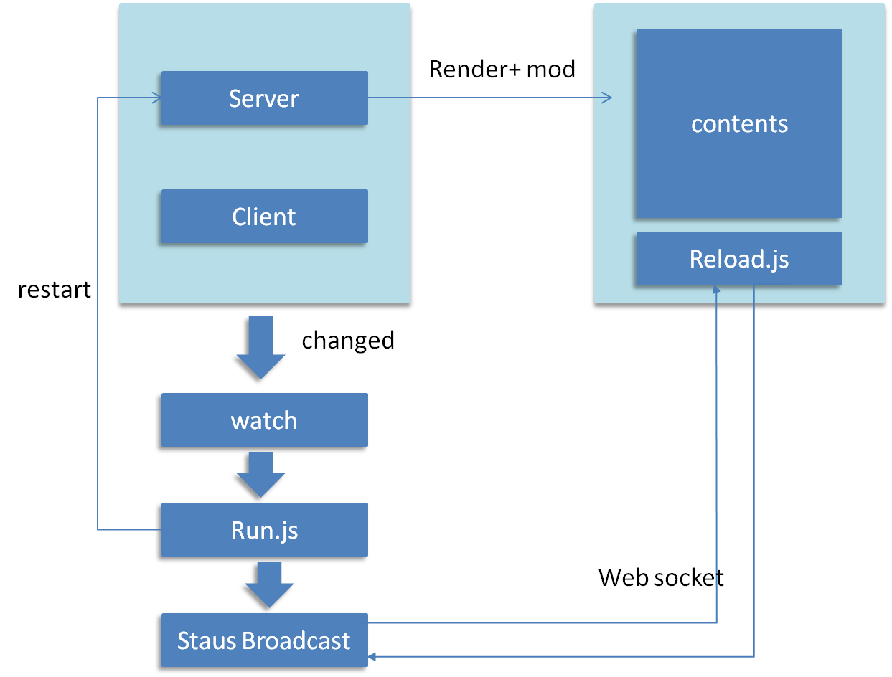
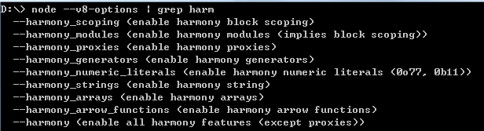

#1 名词解释#
###1.1 工程化###
>前端的工程化就是在前端的项目开发全流程中将成熟的技巧、解决方案、经验模式用工具和约定焊接起来，并形成统一的操作规范，实现工业化生产。

###1.2 多页模式###
>传统的B/S产品适用的前端形态。以同步渲染为主，异步渲染为辅。适合大部分无特殊复杂交互，但页面信息量大的PC端产品。

###1.3 单页模式###
>最近几年开始兴起的一种前端形态，以异步渲染为主，同步渲染为辅。适合大多数重数据交互，重用户体验，总体信息量不大的H5应用。形态比较类似C/S形态。

###1.4 同构###
>用js编写的应用能同时执行于浏览器端和服务器端，实现server和browser的组件与库共享。

>目前追求完全同构的产品比较少，主要还是适当运用部分同构的技巧来增加代码的复用性，和实现服务器组件渲染。

###1.5 组件化###
>将一整块业务或者系统，按照其功能的独立性，而拆分成各个独立的功能模块的过程，和传统的jq ui等组件思想不太一样，更加接近具体业务。

>jqui等组件是尽量做到通用，在不同的场景中使用，而组件化是指将一个具体的页面，如何按照不同的功能划分为单元小块，包含了js、css和html。可以理解为界面的片段化。

###1.6 React###
>起源于Facebook的内部项目，用于解决组件化开发的问题，充当前端的模板引擎。

>特点：组件化开发、虚拟dom，JSX。

###1.7 Flux###
>FB提出的一种全新的前端架构模式，用于取代现有的MVC等架构，和React非常高效地结合。核心思想：单向数据流。

###1.8 ReFlux###
>flux本身是一种模式，而reFlux是这种模式的一种具体实现，同时为了简化开发对于原有模式做了一些调整，仅保留了action、store、component。

###1.9 Generator###
>ES6的一种新特性，异步编程的解决方案，可以理解为一个状态机，使用yield语句来定义不同的内部状态，执行Generator后会返回一个遍历器对象，可以通过该对象的next方法遍历其内部的不同的状态。 使用Generator可以避免异步回调嵌套问题，提高错误的处理效率。

###1.10 KOA###
>一个用于取代express的中间件框架，更加小巧灵活，不绑定任何中间件，由自己根据实际需要做加法，比较适合征地业务的量身定制。

#2 设计原则#
- 从实际需要出发，不做大而全的框架
- 先进性紧跟BAT，但又能确保简单上手
- 重视扩展性，便于随着业务增长做加法
- 重用户体验，性能
- 工程化贯穿，能用工具实现的就用工具实现

#3 总体设计#

#4 PC架构设计#

##4.1 概况##

##4.3 目录结构##

	-root
		{package.json}
		{bower.json}
		{glup.js}
		[bin] 存放可执行文件（二进制可执行文件、shell、bat等）
		[conf] 存放应用程序配置文件
		[node_modules] 三方模块及自己封装的node模块
		[log] 存放日志
		[app] server端
			[libs] 工具库、业务中间件、mvc框架
			[controller] 控制器
			[models] 模型
			[router] 路由配置
			[template] 模板
			[test] 单元测试
		[client] browser端
			[bower] bower管理的外部模块，含jq、bootstrap等
			[js]
				[libs] 非bower管理的公共库,及zuesLib
				[conf] 存放js配置，如映射关系、公共常量、文字宏等
				[ui] UI组件
				[common] 公共业务逻辑
				[page] 页面级js
			[css]
				[libs] 非bower管理的公共库
				[ui] UI组件
				[custom] 包含site全局风格、jq ui的custom
				[page] 页面级js
			[font] 存放font-icon
			[img] 图片资源
			
##4.4 server端##

### 4.4.1 总体设计思路 ###
- 以轻巧灵活的koajs为中间件框架，以中间件模式为业务开发的核心模式
- 纵向上划分filter、router、controller、models、views，基于中间件模式封装mvc框架
- 横向上按module进行划分系统级别配备conifg管理、日志处理、异常捕获

### 4.4.2 运行环境 ###
>node 0.12.3

### 4.4.3 进程 ###
>分两组服务：一组用于业务处理（8080）、一组用于静态文件服务器（8081）
>服务通过PM2开启集群模式，集群内进程实例数由CPU数决定，开发模式下不开启集群

### 4.4.4 工作流程图 ###

### 4.4.5 bootstrap ###
>启动程序，程序的总入口，负责加载配置文件，公共模块，初始化日志组件、初始化模板引擎、初始化koajs、注册中间件等

### 4.4.6 filter ###
>由多个注册到koa上的中间组成，用于在req->res模型中处理公共业务,如cookie签名等，公共业务逻辑也可以考虑

### 4.4.7 router ###
>使用koa-router中间件模块，用于url路由配置

### 4.4.8 controller ###
>接受到请求后向后请求models获取数据，并调用对应的模板进行渲染

### 4.4.9 models ###
>负责请求后端数据和缓存数据，处理业务逻辑

### 4.4.10 views ###
>ejs模板存放

### 4.4.11 映射关系 ###
>m-v-c间存在目录映射关系，通过文件命名来约束

### 4.4.12 基类 ###
>提供baseController、baseModels，提供render、getModel等基类方法

### 4.4.13 API ###
>考虑到异步请求的情况，baseController提供api方法，API的Controller不需要调用view，直接返回json

##4.5 模板层级与复用##

### 4.5.1 划分原则 ###
- 职能从大到小分四级划分 site->module->page->block
- site: 整个站点，拥有各个module和站点级别的公共block，如header、footer、nav等
- module: 模块级别，拥有一组类似的页面和这些页面间共用的block
- page: 页面级别，对应一个action，拥有一个页面模板和私有block
- block：最小模板单元，对应页面中一个功能UI区

### 4.5.2 目录示例 ###
    -[template](站点)
		-[blocks](站点级block)
			-{header.ejs}
			-{footer.ejs}
			-{nav.ejs}
			...
		-[account](模块)
			-[blocks](模块级block)
				-{account-info.ejs}
				-{account-side.ejs}
			-[home](页面)
				-[blocks]
					-{income.ejs}
					-{calendar.ejs}
				-{page.ejs}(页面框架)
			-[invest]
			-[bankcard]
			...
		-[home]
		-[financing]
		-[service]
		-[aboutus]
		...

### 4.5.3 注意事项 ###
- block应为一个完整的业务功能可视区
- block默认位于页面目录中的block目录中
- 在一个module内，凡是两以上页面共用的block归到module的block目录中
- 一个module中页面不能引用另外一个module中的block
- 跨module的block复用需要归类到站点下的block目录中

##4.6 日志设计##

###4.6.1 统一格式###
	NOTICE: 2015-09-02 13:45:08 at recordLog (fileXXX:110:11) logid logmsgXXX

###4.6.2 日志文件###
- 日志文件统一打到log目录下

- node.log 服务级别日志，记录服务的启停，相关错误等

- tiancai.log 一般请求的日志(notice)

- tiancai.log.wf 错误类日志(warn、fatal)

- tiancai.log.dev 调试类日志(debug、trace)

###4.6.3 日志分级###
	'debug' : 1,
    'trace' : 2,
    'notice' : 3,
    'warn' : 4,
    'fatal' : 5,
    'error' : 6

###4.6.4 日志打印方式###
>使用node的文件流打印 createWriteStream

###4.6.5 生成logid规则###
	Date.now()*1000+Math.floor(Math.random()*1000)

###4.6.6 配置项设置###
	'bdlog' : {
        'path' : './log/tcwise.log',  //日志打印目录
        'maxLength' : 6000,   //单条最大长度
        'level' : 3,	//输出级别
        'printTty' : false, //是否显示反馈
        'printFile' : true //是否打印日志文件
    }

###4.6.7 其他###
为了便于调试和定位，系统的console.log 被重写debug日志方法，写入到tiancai.log.dev

##4.7 browser端##

###browser端概述###
- 配合浏览器端ejs的同步输出，以多页面形态呈现，同步为主、异步为辅样的思想
- 交互开发上主要以jq为core面向dom编程，以事件绑定为驱动，不用做到组件化编程
- 样式和js采用层次层叠的方式，即由site->page这样的层次，其中抽象的UI部分也在site的范畴，在页面中只是实例化为page内的具体业务功能。
- 逻辑的主体是页面

###Site Level JS###
- 包含内容：jq、jqui、zeus(page、utils)
- page部分在下节介绍，utils提供公共方法如cookie、localstorage等，可以由大家继续扩充

###Page Level JS###
- 对于page提供一个zeus.page()方法，内置initDatas(datas)、initParts(parts)、bindEvent供统一开发风格。
- initData用于统一初始化页面内状态数据、其他地方不再用var页面级别变量
- initParts用于统一缓存化页面中需要交互的jq对象，供后面的逻辑使用，其他地方不再用$直接获取，但可以用find方法寻找下一级dom。
- bindEvent用于统一事件绑定,绑定到对应的业务函数入口。
- $.ready之后会自动调用page的init的方法，完成initDatas(datas)、initParts(parts)、bindEvent
- 其他逻辑封装成其他函数挂在zeus.page()的设置对象中，函数不允许堆砌，以独立的逻辑为单位，过长的函数需进一步拆分
- 示例：

	
		zeus.page({
			//初始化数据
			initDatas： function() {
				var time = new Date();
				this.data = {
					time: time,
					timeHasShow: false,
					timeMultiplier: 3
				}
			},
			//初始化部件
			initParts: function() {
				this.parts = {
					$timeContent: $('.time-content'),
					$showTimeBtn: $('.time-btn')
				}
			},
			//绑定事件
			bindEvent: function() {
				var this = me;
				var parts = me.parts;
				parts.$showTimeBtn.on('click', function() {
					me.showTime();
				})
			},
			//业务函数
			showTime: function() {
				var data = this.data;
				if(!data.timeHasShow){
					var timeText = data.time * data.timeMultiplier;
				    this.parts.$timeContent.html(timeText);
					data.timeHasShow = true;
				}
			},
			//业务函数
			...
			//业务函数
			...
			
		})

###Site Level CSS###
- 包含bootstrap、jqui css、global、jqui custom
- global是根据整体UI风格对bootstrap的补充和覆盖
- jqui custome 是根据整体UI风格对jq ui样式的覆盖

###Page Level CSS###
主要用于页面级别的样式微调，根据规范（见8章）照写即可。

###打包###
site Level的js和css打成一个包，page的不需要打包，跟页面走即可

#5 H5架构设计#

##5.1 概述##
- H5采用单页模式开发（SPA），对于规模较大的app，可以进一步拆分，拆分成多个spa组合。
- 该模式下，browser端采用reflux的架构，server端架构和PC几乎保持一致，唯一区别在于使用上的角色差异。
- PC的server端扮演了较多的业务逻辑和模板渲染的角色，而H5的server端更多的扮演数据接口、首页渲染的角色。
- 逻辑的主体是组件

##5.3 目录结构##
	-root
		... server目录同PC
		[client] H5 browser端
			[bower] bower管理的外部模块，含zepto、bootstrap等
			[js]
				[libs] 非bower管理的公共库
				[conf] 存放js配置，如映射关系、公共常量、文字宏等
				[components] react组件
				[mixins] 共享方法
				[action] relux action
				[store] reflux store
			[css]
				globe.less 站点公共样式（非bootstrap）
				[components] react组件对应的css
			[font] 存放font-icon
			[img] 图片资源

##5.4 server端##
与pc端架构一致，参考4.4章节

##5.5 browser端##

###browser端概述###
H5的browser端主要采用Flux+React的架构，组件化开发，遵循单一数据流，事件驱动，为了简化开发采用了改进版的Reflux实现。
对于首页的同步渲染问题，我们主要采用ejs来输出同构组件的服务器渲染结果

###flux架构###
FaceBook最初提出的FLUX模式较为复杂，为了不造成大家的困惑，这里直接跳过介绍Reflux的简化架构

- 1. store负责数据存储，同时监听action
- 2. components负责界面渲染，和维护虚拟dom，同时负责监听用户的行为事件监听
- 3. components监听到事件后会主动调起某些action，并传递model
- 4. store发现到自己监听的action被调用后，执行对应的回调函数，完成数据的更新
- 5. 其他通过Reflux.listenTo或者Reflux.connect和该store进行关联的组件进行更新

###components###
使用React.createClass创建react组件，在组件的不同生命周期或事件回调中执行相应的逻辑或调用相关的action

代码示例：

		//创建组件
		var TodoComponent = React.createClass({
			    mixins: [Reflux.listenTo(TodoStore, 'onStatusChange')],
			    getInitialState: function () {
			        return {list: []};
			    },
			    onStatusChange: function () {
			        this.setState({list: TodoStore.items});
			    },
			    render: function () {
			        return (
			            

			                {this.state.list.map(function (item) {
			                    return 
{item}

			                })}
			            

			        )
			    }
			});
		//渲染到页面
		React.render(<TodoComponent />, document.getElementById('container'));

###action###
- 使用Reflux.createActions创建，支持同时创建多个action
- 创建单个action：

		var statusUpdate = Reflux.createAction(options);
		
- 创建多个action：

		var TodoActions = Reflux.createActions([
			'addItem'
		]);

###store###
- 使用Reflux.createStore创建，将定义对象作为参数传递进去，主要包含数据、处理逻辑、绑定需要监听的Action。
- 监听单个action：

		this.listenTo(statusUpdate, 'statusUpdate');
- 监听多个action

		listenables: [TodoActions],

- 创建示例

		var TodoStore = Reflux.createStore({
		    items: [1, 2],
		    listenables: [TodoActions],
		    onAddItem: function (model) {
		        $.post('/server/add', {data: model}, function (data) {
		            this.items.unshift(data);
		            this.trigger(this.items);
		        });
		    }
		});	

###同构###
我们这里使用的同构是部分同构，主要是征对首页的同构，目的是加速初次渲染性能，提升首次数据展示的用户体验，利于SEO. 利用的技术如下：
- browserify确保了我们可以使用commonjs的写法进行模块管理,能同时在node上执行
- koa-router决定首页的router，在koa中借助React.renderToString获得渲染的string
- 通过ejs的render，将string渲染进页面，并返回
- browser端初始化后，react会校验服务器渲染结果，如果校验一致，会不再渲染，而是在内存中创建虚拟dom，并与之关联。而用户对这一切无感知
- 后续的router为spa的路由，借助react-router实现

#6 APP架构设计#

##6.1 概况###
由于APP采用的是native用webview嵌入H5的思路，APP的整体架构和H5保持一致，server端和browser端均一致，差异在于具体开发业务时，可能根据实际的需要，Native shell会和H5进行数据交互，这里只约定数据交互的规范，其他在具体的开发过程中，由开发双方根据场景确定。

##6.2 架构###
参考H5部分（5章节）

##6.3 native分工###
native负责主要的外部逻辑，转场动画等
H5仅仅作为展示的内部区块，以webview方式提供页面，区块的划分由native来划分，并最终提需求到H5这边提供对应的页面

##6.3 native数据交互约定###
- native获取H5数据：在页面中定义一段script，用于专门包装给native
	
		<script id="toNative">
			window.PageData = {
				...
			}
		<script>

- H5获取native数据：native包装成统一的方法供JS调用，获取数据均以getXXX的方式获取
- 两者各自处理各自的逻辑

#工程化设计#

##初始化##
- 命令

		zeus pc
		zeus h5

- 作用：创建一个新的工程的骨架，支持pc和h5两种形态
- 设计思路：基于yo开发两套generator，generator包含设计中两种形态的架构模板

##开发环境##
- 命令
	
		zeus dev
- 作用：启动开发环境，同时开启热重启模式，支持开发时自动刷新浏览器
- 设计思路：使用runjs和live-reload二次开发，同时支持修改client代码和server代码的重启
- 工作流程示意图

	

##调试##
- 命令 

		zeus debug
- 作用： 一般开发使用开发模式，结合log可以解决大多数问题，遇到疑难杂症，可以开启debug模式，支持浏览器中的inspector，便于可视化的断点调试等。
- 设计思路：将node-inspector集成到命令的逻辑中

##提测##
- 命令

		zeus test
- 作用：检查代码规范 -> 执行单元测试 -> 检索依赖打包 -> ci
- 设计思路：集成fecs进行代码检查、支持mocha进行单元测试、对于less、jsx进行编译、使用gulp、browsify等进行代码打包压缩，输出output。并ci

##上线##
- 命令 

	
		zeus deploy
- 作用： 线上更新代码、无缝重新加载
- 设计思路：集成pm2，并封装相关命令

##运维##
- 提供PM2 web视图监视进程、同时产出多份log供追查问题

##规范##
- javascript 规范
- Css 规范
- HTML 规范

##资料##

###harmony###
node 0.12.3中harmony的支持情况

harmony 开启方式：node --harmony app.js

###Generator###
>介绍文章 http://es6.ruanyifeng.com/#docs/generator

###koajs###
>项目地址 https://github.com/koajs/koa

###koa-static###
>项目地址 https://github.com/koajs/koa

###koa-router###
>项目地址 https://github.com/alexmingoia/koa-router

###co###
>项目地址 https://github.com/tj/co	
	
###ejs###
>项目地址 https://github.com/tj/ejs
	
###supervisor###
>项目地址 https://github.com/petruisfan/node-supervisor

###live-reload###
>项目地址 https://github.com/intesso/connect-livereload

###node-inspector###
>项目地址 https://github.com/node-inspector/node-inspector
>学习资料 http://jingyan.baidu.com/album/dca1fa6fbd580ff1a44052de.html

###gulp###
>项目地址 https://github.com/gulpjs/gulp

###mocha###
>项目地址 https://github.com/mochajs/mocha

###shouldjs###
>项目地址 https://github.com/tj/should.js

###fecs###
>项目地址 https://github.com/ecomfe/fecs

###pm2###
>项目地址 https://github.com/Unitech/PM2

###pm2-web###
>项目地址 https://github.com/achingbrain/pm2-web

###less###
>项目地址 https://github.com/less/less.js

###bootstrap###
>项目地址 http://v3.bootcss.com/

###browserify###
>项目地址 https://github.com/substack/node-browserify
	
###reactjs###
>项目地址 https://github.com/facebook/react

>学习资料 http://www.ruanyifeng.com/blog/2015/03/react.html?utm_source=tuicool

###reactify###
>项目地址 https://github.com/andreypopp/reactify

###reflux###
>项目地址 https://github.com/reflux/refluxjs

>学习资料 http://segmentfault.com/a/1190000002793786?utm_source=tuicool
