## Debug && Test Quick start ##

## 安装前准备 ##

- 参考zeusjs的安装步骤，完成安装和初始化（安装最新版本，用最新的版本新建新的项目，之前已经初始化并开发的项目可以diff合并，最简单的方式是可以新建一个项目，把业务代码合并过来，目前特殊时期，一边在开发zeujs，一边在用，以后骨架稳定后就不需要频繁合并了）

	移步参考 [ https://github.com/tftc/zeus/blob/master/doc/quickstart.md](https://github.com/tftc/zeus/blob/master/doc/quickstart.md "https://github.com/tftc/zeus/blob/master/doc/quickstart.md")
- 增加安装一个全局依赖node-inspector

		sudo npm install -g -d node-inspector --registry=https://registry.npm.taobao.org

## 调试使用方法 ##
- 说明 

		这里说的debug是指nodejs的debug，浏览器端的debug，直接使用zeus dev命令，切换到开发模式，页面中加载的js和less均为编译前的源码，可以直接用chrome的开发工具进行相关调试。nodejs的debug需要zeus debug命令开启专门征对node的调试功能

- 执行命令
		
		zeus debug

- 执行完成后自动打开调试面板
		
	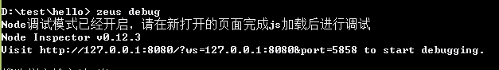

	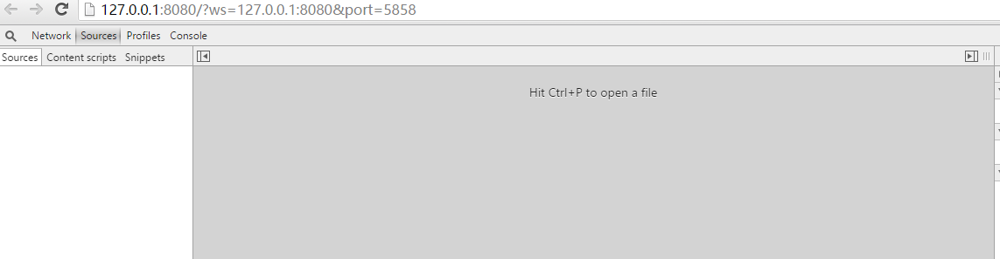

- 等待调试面板加载完所有的js依赖(由于node_modules比较大，大约10多秒后看见下面界面，即可开始调试)
		
	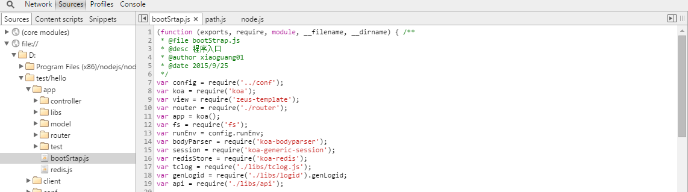

- 设置断点（举例，在controller的login中的login方法中设置断点）
		
	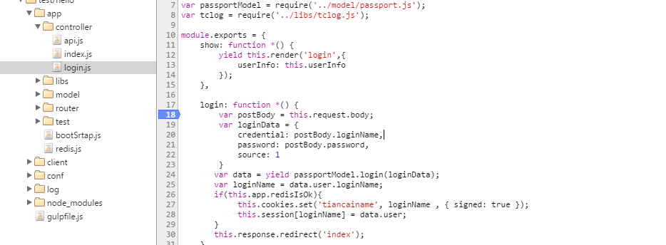

- 打开页面，触发相关业务功能（输入用户名密码，点击立即登录）
		
	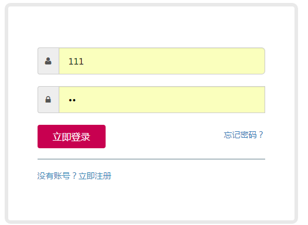

	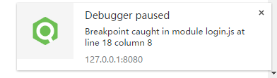

- 触发断点，继续调试（参考右侧的工具，进行单步等调试工作，鼠标上浮变量提示）
		
	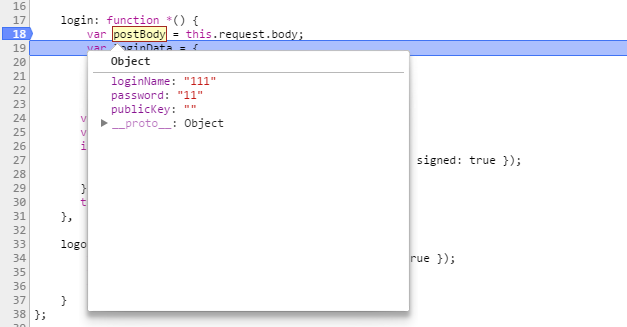

	

## 提测功能 ##
- 参考新生成的项目骨架及demo放置业务less和js
- 在zeus dev下，可以查看页面中加载的是源代码
	
	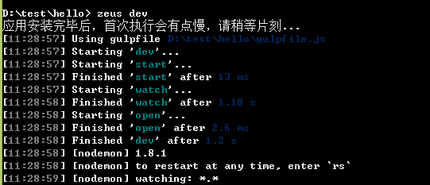

	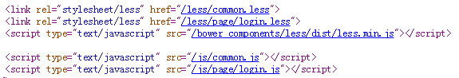

	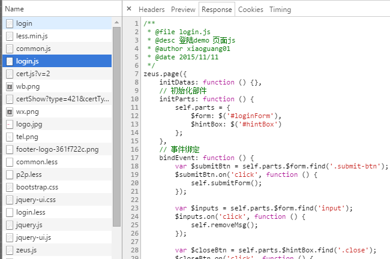

- 切换到zeus test状态，进行编译（代码检查、单测、预处理、压缩、合并、拷贝到build目录）
	
	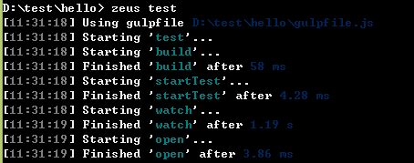

- 重新打开页面（目前还没有加时间戳，需要ctrl+F5强刷下）
	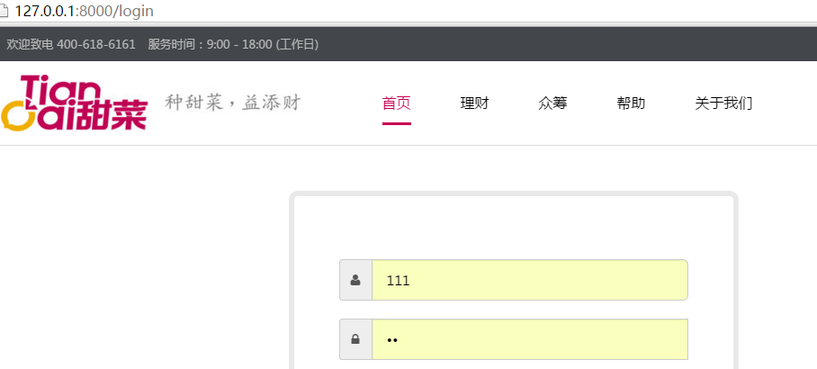

- 此时在命令行下会出现单测和代码检查的结果
	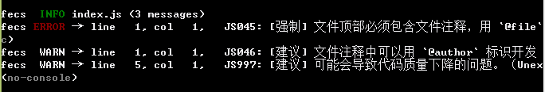

- 打开页面，查看页面源码可以看到加载的是编译后的代码
	
	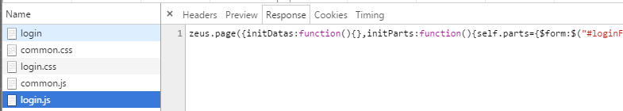

- 编译后检查命令无误、及页面个功能整体自测均正常后即可提测
